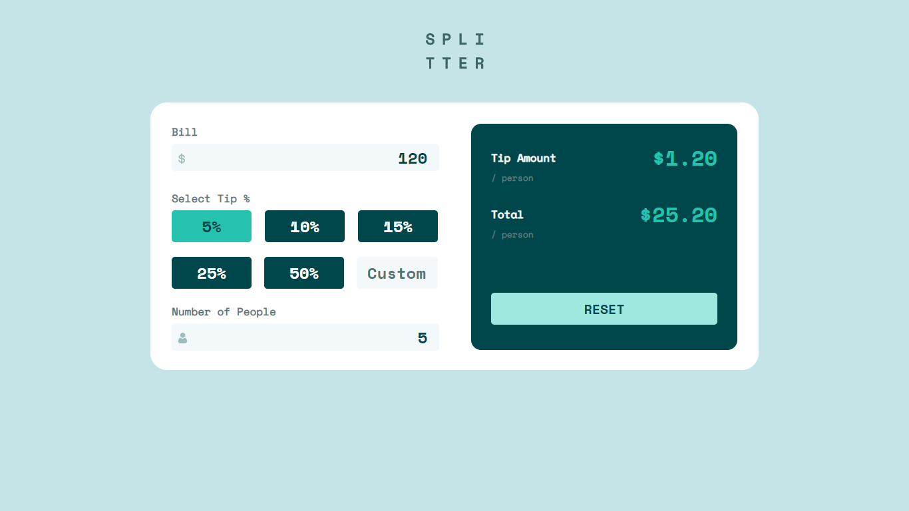

# Tip Calculator App

## Overview

### The challenge

Users should be able to:

- View the optimal layout for the app depending on their device's screen size
- See hover states for all interactive elements on the page
- Calculate the correct tip and total cost of the bill per person

### Screenshot

### Links

- Solution URL: [GitHub Code](https://your-solution-url.com)
- Live Site URL: [GitHub Live](https://your-live-site-url.com)

## My process

### Built with

- Semantic HTML5 markup
- CSS custom properties
- Flexbox
- Mobile-first workflow

### What I learned

Is this project I firstly used DOM manipulations to calculate tip amount and total bill amount.

